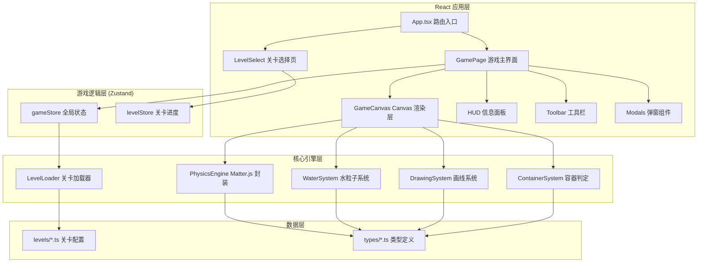

## 1. 架构设计



---

## 2. 技术栈说明

| 类别 | 技术选择 | 版本 | 说明 |
|------|----------|------|------|
| 前端框架 | React | 18.x | 组件化 UI 开发 |
| 语言 | TypeScript | 5.x | 类型安全 |
| 构建工具 | Vite | 5.x | 快速开发构建 |
| 样式方案 | Tailwind CSS | 3.x | 原子化 CSS |
| 状态管理 | Zustand | 4.x | 轻量状态管理 |
| 物理引擎 | Matter.js | 0.19.x | 2D 刚体物理模拟 |
| 图标库 | lucide-react | latest | 矢量图标 |
| 路由 | react-router-dom | 6.x | 页面路由 |

---

## 3. 目录结构

```
solo6-85/
├── src/
│   ├── components/
│   │   ├── game/
│   │   │   ├── GameCanvas.tsx      # Canvas 游戏画布
│   │   │   ├── HUD.tsx             # 顶部信息栏
│   │   │   ├── Toolbar.tsx         # 底部工具栏
│   │   │   ├── LevelCompleteModal.tsx
│   │   │   └── LevelFailModal.tsx
│   │   └── levels/
│   │       ├── LevelCard.tsx
│   │       └── LevelGrid.tsx
│   ├── pages/
│   │   ├── LevelSelect.tsx         # 关卡选择页
│   │   └── GamePage.tsx            # 游戏主页面
│   ├── game/
│   │   ├── types.ts                # 游戏类型定义
│   │   ├── PhysicsEngine.ts        # Matter.js 封装
│   │   ├── WaterSystem.ts          # 水粒子系统
│   │   ├── DrawingSystem.ts        # 画线系统
│   │   ├── ContainerSystem.ts      # 容器判定系统
│   │   └── LevelLoader.ts          # 关卡加载器
│   ├── levels/
│   │   ├── index.ts                # 关卡配置导出
│   │   ├── level1.ts
│   │   ├── level2.ts
│   │   └── level3.ts
│   ├── store/
│   │   ├── gameStore.ts            # 游戏运行时状态
│   │   └── levelStore.ts           # 关卡进度存储
│   ├── utils/
│   │   └── helpers.ts
│   ├── App.tsx
│   ├── main.tsx
│   └── index.css
├── index.html
├── package.json
├── vite.config.ts
├── tailwind.config.js
└── tsconfig.json
```

---

## 4. 路由定义

| 路由 | 页面组件 | 用途 |
|------|----------|------|
| `/` | LevelSelect | 关卡选择首页 |
| `/game/:levelId` | GamePage | 游戏主界面，根据 levelId 加载对应关卡 |

---

## 5. 核心数据模型

### 5.1 关卡配置类型 (LevelConfig)

```typescript
interface LevelConfig {
  id: string;
  name: string;
  description: string;
  worldWidth: number;
  worldHeight: number;
  gravity: number;           // 重力加速度
  inkLimit: number;          // 墨水总量（可画线的长度）
  waterSource: {
    x: number;
    y: number;
    rate: number;            // 每秒出水粒子数
    maxParticles: number;    // 最大同时存在粒子数
    particleRadius: number;  // 粒子半径
  };
  containers: ContainerConfig[];
  obstacles: ObstacleConfig[];  // 预置地形障碍
  holdTime: number;           // 达标保持时间（秒）
  timeLimit?: number;         // 可选：时间限制（秒）
}

interface ContainerConfig {
  id: string;
  x: number;
  y: number;
  width: number;
  height: number;
  wallThickness: number;
  targetCount: number;        // 目标水粒子数
  color: string;
}

interface ObstacleConfig {
  type: 'rect' | 'circle' | 'polygon' | 'line';
  x: number;
  y: number;
  width?: number;
  height?: number;
  radius?: number;
  vertices?: { x: number; y: number }[];
  points?: { x: number; y: number }[];  // 对于 line 类型
  angle?: number;
  color?: string;
}
```

### 5.2 游戏状态类型 (GameState)

```typescript
interface GameState {
  status: 'idle' | 'playing' | 'paused' | 'complete' | 'failed';
  currentLevelId: string | null;
  elapsedTime: number;
  inkUsed: number;
  waterParticlesCount: number;
  containerProgress: Record<string, { current: number; target: number; filled: boolean; holdTimer: number }>;
  tool: 'pen' | 'eraser';
  isPaused: boolean;
}
```

### 5.3 关卡进度类型 (LevelProgress)

```typescript
interface LevelProgress {
  levelId: string;
  unlocked: boolean;
  completed: boolean;
  stars: number;       // 0-3 星评价
  bestTime?: number;
  bestInkUsed?: number;
}
```

---

## 6. 关键技术实现说明

### 6.1 物理引擎封装 (PhysicsEngine)

- 基于 Matter.js 的 `Engine`、`World`、`Bodies`、`Body` 等核心模块
- 维护独立的物理世界，按固定时间步长更新
- 水粒子使用 `Bodies.circle` 创建，高密度 + 高弹性 + 低摩擦模拟流体
- 玩家画线通过将路径点采样生成密集的小矩形拼接成连续刚体

### 6.2 水粒子系统 (WaterSystem)

- 对象池模式复用粒子，避免频繁 GC
- 粒子间无相互作用力（简化方案，用密集小球近似流体）
- 控制最大粒子数，超出后最旧粒子自动回收
- 粒子渲染使用径向渐变模拟发光水滴效果

### 6.3 画线系统 (DrawingSystem)

- 监听 `pointerdown` / `pointermove` / `pointerup` 事件
- 记录绘制路径点，相邻两点距离超过阈值时插入采样点
- 绘制完成后将路径转换为 Matter.js 静态刚体链
- 橡皮擦模式下检测点击位置与已画线段的碰撞并删除

### 6.4 容器判定系统 (ContainerSystem)

- 容器由三条边（左、右、底）组成 U 形静态刚体
- 每帧检测所有水粒子是否落在容器矩形范围内且 y > 容器顶部
- 连续 n 帧在容器内的粒子计入有效计数
- 当所有容器均达标并保持 `holdTime` 秒后触发过关

### 6.5 关卡配置驱动

- 每个关卡为独立的 `.ts` 文件导出 `LevelConfig` 对象
- `levels/index.ts` 统一导出数组，新增关卡只需加文件 + 加导出
- 关卡预览通过读取配置绘制缩略图实现
