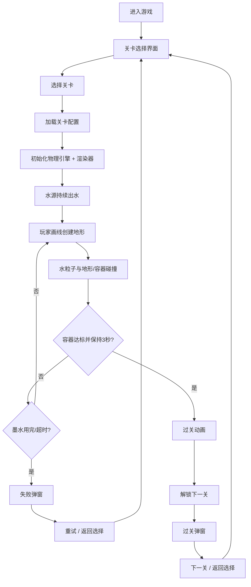

## 1. 产品概述

一款基于 Canvas + Matter.js 物理引擎的 2D 益智小游戏，玩家通过在屏幕上画线创建刚体地形，引导水源流出的水粒子流入目标容器，达到指定水量并保持数秒即可过关。

- 核心玩法：物理模拟 + 画线解谜，考验玩家的空间思维和物理直觉
- 目标用户：喜欢休闲益智类游戏的玩家，覆盖各年龄段
- 产品价值：提供轻松有趣的解谜体验，扩展性强，便于后续新增关卡和玩法

---

## 2. 核心功能

### 2.1 功能模块

1. **游戏主界面**：Canvas 游戏画布 + HUD 信息栏 + 工具栏
2. **关卡选择界面**：关卡列表展示、解锁状态、关卡预览
3. **物理引擎模块**：水粒子系统、静态刚体、碰撞检测、重力模拟
4. **画线系统**：鼠标/触摸绘制、线段转刚体、线条擦除
5. **水源系统**：持续生成水粒子、速率控制
6. **容器系统**：水粒子计数、目标水量、达标保持判定
7. **过关结算**：过关动画、关卡解锁、下一关入口
8. **关卡配置系统**：JSON 配置驱动、热插拔新关卡

### 2.2 页面详情

| 页面名称 | 模块名称 | 功能描述 |
|-----------|-------------|---------------------|
| 关卡选择页 | 关卡卡片网格 | 展示所有关卡，显示解锁/完成状态，点击进入 |
| 关卡选择页 | 顶部标题栏 | 游戏标题、返回/设置入口 |
| 游戏主界面 | Canvas 游戏区 | 物理世界渲染、水粒子、地形、容器 |
| 游戏主界面 | HUD 信息栏 | 当前关卡名、容器进度百分比、计时器、墨水用量 |
| 游戏主界面 | 工具栏 | 画笔工具、橡皮擦、重置关卡、暂停/继续、返回 |
| 过关弹窗 | 结算面板 | 过关恭喜、星级评价、返回选择、下一关 |
| 失败弹窗 | 提示面板 | 水用完/超时提示、重试、返回选择 |

---

## 3. 核心流程

---

## 4. 用户界面设计

### 4.1 设计风格

- **主色调**：深海蓝 (#0ea5e9) 作为水元素主色，搭配琥珀黄 (#f59e0b) 作为容器进度色，墨黑 (#1f2937) 作为画笔色
- **辅助色**：浅灰蓝背景 (#f0f9ff)，柔和绿色过关提示 (#10b981)
- **按钮风格**：圆角胶囊按钮 (rounded-full)，微渐变填充，悬停浮起阴影，点击下沉
- **字体**：标题使用 "Fredoka"（圆润可爱的卡通字体），正文使用 "Noto Sans SC"
- **布局风格**：全屏沉浸式游戏区，HUD 悬浮在画布上半部分，工具栏固定在底部
- **视觉元素**：水粒子带发光效果，线条有毛笔书写感，容器带玻璃拟态质感

### 4.2 页面设计概览

| 页面名称 | 模块名称 | UI 元素 |
|-----------|-------------|-------------|
| 关卡选择页 | 关卡卡片 | 卡片带缩略图预览、关卡编号、锁定/完成图标、悬浮缩放动画 |
| 游戏主界面 | Canvas 区 | 水粒子发光尾迹、容器液体波纹效果、线条渐变填充 |
| 游戏主界面 | HUD | 半透明毛玻璃面板、进度条带涟漪动画、数字动态滚动 |
| 游戏主界面 | 工具栏 | 图标按钮、选中高亮、墨水用量环形进度条 |
| 过关弹窗 | 面板 | 中心弹出 + 缩放动画、彩带粒子效果、三星评分展示 |

### 4.3 响应式设计

- 桌面端优先，Canvas 固定 1000×600 逻辑分辨率，通过 CSS 自适应缩放
- 移动端触摸事件支持，工具栏增大触摸区域
- 超窄屏下 HUD 自动换行堆叠
